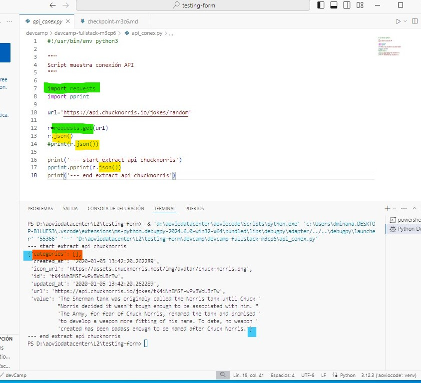

<a id="menu"></a>
# MENU

- [¿Para qué usamos Clases en Python?](#paraque)
- [¿Qué método se ejecuta automáticamente cuando se crea una instancia de una clase?](#metodo)
- [¿Qué es una API?](#qesapi)
- [¿Cuáles son los tres verbos de API?](#verapi)

# <a id="paraque"> ¿Para qué usamos Clases en Python?</a>
[up](#menu)

Al realizar una primera búsqueda en Chrome como: **"¿qué son las clases en Python?"**. La primera respuesta que me encuentro es: **"Las clases en Python son estructuras de programación orientada a objetos"**.

Bien, pues como siempre, realizamos un análisis de la pregunta, ese sería mi primer paso para saber para qué usamos las clases en Python, para lo cual tendremos que saber qué son las clases.

Entonces, si recordamos, ¿qué son estructuras? Y nos respondemos en alto: las estructuras nos muestran cómo organizar y la sintaxis necesaria para escribir nuestro código.

Y por supuesto, aprendemos que **la programación orientada a objetos es un paradigma de programación**, que se basa en la idea de que los programas se pueden organizar como una colección de objetos interconectados, cada uno con su propio conjunto de datos y funcionalidades.

Este paradigma de programación nos ofrece poder simplificar la creación de un programa, separando sus diferentes componentes, mejora la depuración de dicho programa y la escalabilidad posterior.

Otras de las características de la POO, programación orientada a objetos, es que nos permite reducir los errores y promociona la reutilización del código.

Hay conceptos con los que vamos a tener que lidiar, ya que son usados en la POO, tales como:

- Abstracción de datos.
- Encapsulación
- Eventos
- Modularidad
- Herencia.
- Polimorfismo

Podríamos decir que la programación orientada a objetos se aproxima más a las situaciones de la vida real, un ejemplo rápido podría ser:

- Visionemos una cocina estándar, muebles, electrodomésticos, cajones. Cada objeto de la cocina contiene una clase de artículos, y una cantidad diferente por artículo. Están colocados teóricamente por su uso o consumo. Entonces.

Nos piden que creemos un programa que contabilice todo el inventario y stock de dicha cocina. Estamos de acuerdo y nos ponemos manos a la obra.

En nuestra programación orientada a objetos, construimos **estructuras** que nos permiten construir objetos para poder obtener todos los beneficios del método de **programación orientada a objetos** que estamos utilizando.

Existen varios beneficios de utilizar este paradigma de programación y uno de ellos es mantener por separado los datos, de la funcionalidad dentro del propio objeto.

- Consideremos el ejemplo de nuevo con lo leído hasta ahora, programa, cocina, creamos objetos independientes pero conectados. Cada mueble podría ser una clase, clase mueble alto. Dentro de la clase mueble alto, podría haber un contador por cada tipo de plato. La funcionalidad de contar es independiente de la cantidad total de platos que tengamos y su tipo. Eso vendrá marcado por la instancia que creemos.

La respuesta que daría a esta pregunta es evidente utilizamos las clases para crear objetos de nuetro programa que nos permitan separar los datos y la funcionalidad independiente, previniendo errores de programación, permitiendonos mejorar nuestra depuración y ofreciendonos un futuro más controlado.

Pasemos a un ejemplo con código, y terminemos de entender y comprender que són, para que són, y que utilidad nos ofrecen las clases. Como siempre comenzemos con la sintaxis.


```python
"""Ejemplo básico veamos como gestiona una clase estas dos vertientes datos y funcionamiento"""

# Creamos la primera clase Basico, solo tiene que imprimir un mensaje.
class Basico:
    print('My first class')

# Creamos la instancia, llamamos a la clase Basico y lo pasamos a la variable msg
msg = Basico()

print('...')

# Queda claro que lo que se ha guardado en la variable msg es un objeto
# de la clase Basico, y que en la dirección de memoria que se muestra estan
# ubicado los datos guardados
print(msg)
```

    My first class
    ...
    <__main__.Basico object at 0x00000201E1DBFF20>
    

**La sintaxis de una clase**

- Tal como mostramos en el ejemplo, comenzamos con la palabra reservada class, seguidamente le damos un nombre a la clase iniciando el nombre con mayúscula y acabamos la expresión con dos puntos.
  - palabra-reservada    nombre-comienza-mayúscula   dos-puntos:
- Hemos creado la primera expresión para crear una clase y tras los dos puntos, tenemos nuestro bloque de código, y, por tanto, debemos aplicar espacio a la siguiente línea.
- Y a partir de aquí y teniendo claro que estamos dentro de la estructura class, podemos desarrollar nuestras funciones, nuestros bucles, nuestras variables, etc.

**¿Cómo llamamos a nuestra clase?**

- Tal cual llamamos a nuestras funciones desde cualquier parte de la aplicación y veíamos que según los parámetros que pasábamos nuestras funciones venían y ejecutaban su propósito, la forma de llamar a una clase se la denomina **creación de instancias**.
- La creación de instancias es el proceso de creación de un objeto de la clase que acabamos de escribir, es la forma que le damos vida a nuestra clase, creando objetos de ella misma con datos y funcionalidad independientes.


```python
class Invoice:
    
    def greeting(self):
        return 'Hi there'

#Creación de instancia
inv_one = Invoice()

print(inv_one)
```

    <__main__.Invoice object at 0x00000201E1DBF2C0>
    

Si vemos lo que nos devuelve, __main__, esta expresión es un método especial llamado main, esto es solo el puntero al objeto creado. Sí, ya tenemos nuestro objeto y esta función main nos detalla la dirección de memoria donde se ha ubicado.

Esta expresión con doble guion bajo al principio y al final se nombra como Dunder main que es la abreviatura de guion bajo doble.


```python
class Invoice:
    
    def greeting(self):
        return 'Hi there'

#Creación de instancia
inv_one = Invoice()
inv_two = Invoice()
print(inv_one)
print(inv_two)

#print(inv_one.greeting())
```

    <__main__.Invoice object at 0x00000201E1D9F2F0>
    <__main__.Invoice object at 0x00000201E1DBF2C0>
    

Ahora si nos fijamos, tenemos dos instancias, y el Dunder main nos muestra las dos ubicaciones en memoria distintas, si tomamos una foto de la situación y teniendo presente el funcionamiento de una función le estamos pasando un parámetro desconocido, "self", este parámetro es obligatorio pasarlo como primer argumento, este argumento es la referencia a la instancia llamada.

# <a id="metodo">¿Qué método se ejecuta automáticamente cuando se crea una instancia de una clase?</a>

[up](#menu)

Comencemos recordando que una instancia de una clase es la forma de llamar a la clase, igual que llamamos a una función llamamos a una clase y disponemos de ella a lo largo de todo nuestro código, entonces cuando llamamos, o creamos una instancia de clase, automáticamente Python ejecuta un método o función.

Ese método que se ejecuta automáticamente es el método constructor o la función especial __init__ o Dunder init. Este método lo provee el propio lenguaje Python, a continuación nos extenderemos mucho más, pero para esta pregunta con tener muy claro que los métodos dunder son métodos del propio lenguaje y que están disponibles para las clases es suficiente.

El funcionamiento es sencillo tal como apretar el botón del ascensor, en cuanto creamos una instancia dunder init, se ejecuta. Vamos a ver un ejemplo que nos mapea todo lo que hemos leído hasta el momento.

Hemos hablado de clases como estructuras que nos permiten mantener datos y funcionamiento juntos, los datos los tenemos que almacenar en memoria y el funcionamiento lo establecemos a través de las funciones que creamos dentro de la clase, en una programación orientada a objetos las clases nos proveen de esta herramienta. Python es bastante único en la forma de interactuar con las clases y donde nos permite trabajar con ellas.


```python
"""Clase básica con dunder __init__"""

class Basic:
    def __init__(self):
        def greeting(self):
            return 'My first class'

msg = Basic()
print(msg)
```

    <__main__.Basic object at 0x00000201E1D9F830>
    

Revisemos lo escrito, hemos creado una clase Basic, la primera letra en mayúscula, hemos creado nuestra función constructora con dunder init, y hemos creado una función de saludo para comprobar la aplicación de funcionamiento. Aunque esta clase evidentemente está mal escrita, su objetivo se ve claro lanzar el mensaje "Mi primera clase". Lo que quería mostraros es como actúa nuestra estimada dunder init. En cuanto creamos nuestra instancia de clase Basic línea 8, init se ha ejecutado automáticamente.


```python
"""Clase básica con dunder __init__, completo"""

class Basic:
    def __init__(self, user):
        self.user = user
    
    def greeting(self):
        return f"My first class by {self.user}"

msg = Basic('Daniel')
print(msg)
print(msg.greeting())
```

    <__main__.Basic object at 0x00000201E1E66540>
    My first class by Daniel
    

Ahora, mostrando la clase bien escrita, vemos que creamos la clase, creamos la función constructora, que le pasamos dos parámetros, el obligatorio para que se llame a sí misma y el que queremos guardar que nos traerá la instancia expresada en la línea 10. Hasta el momento lo que hemos venido viendo es que una vez la instancia se cree, el dato "Daniel" lo recoge la dunder __init__, que se ha ejecutado automáticamente y lo guardamos en la variable "self.user". Después de tener el dato guardado, le aplicamos su comportamiento, en este caso a través de la función "greeting", lo que queremos es que aparezca en el retorno de esa función, tal cual vemos en la respuesta. Por una parte, vemos el objeto de la clase Basic creado en la dirección 0x000… y justo después vemos el comportamiento que le hemos solicitado, lanzando y acoplándose al retorno.

# <a id="verapi">¿Cuáles son los tres verbos de API?</a>

[up](#menu)

Lo primero posicionémonos, sabemos que es una API como recordatorio, una API es una forma de comunicarse entre dos software distintos, y entendemos como forma un lenguaje, definiciones, órdenes, protocolo. Algo establecido para que la comunicación se establezca y se puedan transferir datos entre ambas aplicaciones.

Ahora, **¿qué son los verbos de API?**, los verbos de API, son los métodos de solicitud HTTP, veremos en las siguientes preguntas que para conectar dos aplicaciones distintas(API) necesitamos realizar solicitudes y que estas solicitudes las podemos gestionar con el módulo requests que PyPi nos ofrece. Estas solicitudes pueden ser de distinto tipo, y es por eso que existen los verbos de API, aunque no siempre son verbos, en definitiva es la orden que das para trabajar con los datos, o recursos.

Y si recapitulamos un poquito, dentro del lenguaje o forma de comunicación que establece la API, existen las órdenes, las peticiones específicas de que queremos hacer con el elemento o elementos que solicitamos. Estas peticiones pueden ser de muy distintos tipos, pero cuando nos preguntan por 3, debemos de pensar en las fundamentales, las que más uso tienen, en definitiva, debemos de pensar las solicitudes que más vamos a realizar dentro de la conexión, en este caso serían GET, POST y DELETE. Existen bastantes más, aunque todas las referencias que he encontrado me devuelve las cinco más utilizadas, añadiendo PUT y PATCH.

GET -> Recupera un recurso existente
POST -> Crea un recurso nuevo
DELETE -> Elimina un recurso
PUT -> Actualiza un recurso existente
PATCH -> Actualizar parcialmente un recurso existente

Recordemos que cuando hablamos de recursos, hablamos de datos, imaginemos que estamos conectando dos aplicaciones distintas, una aplicación gestiona las plazas de parking de una empresa, y otra aplicación gestiona los empleados autorizados a utilizar el parking.

Obligatoriamente, se deben comunicar y establecer una misma forma de comunicarse para poder entenderse.

Entonces creamos una API que regulara toda esa comunicación y nos permitirá, lo primero, saber si el empleado que quiere acceder al parking está autorizado, si no amablemente le podemos pedir que desista de su intención. Tendremos posibilidad de saber el número de plazas que disponemos vacías, y mucha más información o datos, o elementos que disponemos en esa comunicación.

API, me suena a colaborar, la colaboración siempre es buena, aumenta nuestros recursos, por lo tanto, nuestras posibilidades.

```text
"""Ejemplo del parking"""

import requests
import SECURITY-PARKING
import AUTH-USER

""" Utilizamos GET recuperamos un recurso o dato existente
# SECURITY-PARKING ha detectado que user 1506 desea acceder
# Solicita que recupere el resurso y le confirme autorización

REQ-ACCESS=REQUEST.GET(AUTH-USER)

# la aplicacion AUTH-USER, recupera y devuelve su autorización
# la aplicacion SECURITY-PARKING actuaria en consecuencia 
# se creo la comunicacion, se transfirieron datos y se ejecutaron
# las instrucciones en cada aplicacion por separado
"""

""" Utilizamos POST creamos un recurso o dato
# SECURITY-PARKING ha detectado que user 1506 desea acceder
# Solicita que recupere el resurso y le confirme autorización

REQ-ACCESS=REQUEST.GET(AUTH-USER)
IF AUTORITHED
REG-ACCESS=REQUEST.POST(USER-ON)

# la aplicacion AUTH-USER, recupera y devuelve su autorización
# la aplicacion SECURITY-PARKING actuaria en consecuencia
# si esta autorizado solicitaria crear un nuevo elemento
# en usuarios activo, teniendo calculado el aforo del parking
# se creo la comunicacion, se transfirieron datos y se ejecutaron
# las instrucciones en cada aplicacion por separado
"""

""" Utilizamos DELETE eliminamos un recurso o dato existente
# SECURITY-PARKING ha detectado que user 1506 desea salir
# Solicita que se elimine el recurso del aforo

REQ-ACCESS=REQUEST.DELETE(USER-ON)

# la aplicacion AUTH-USER, recupera y elmina el recurso
# en usuarios activo, tenemos actualizado y calculado el aforo del parking
# se creo la comunicacion, se transfirieron datos y se ejecutaron
# las instrucciones en cada aplicacion por separado
"""
```


# <a id="qesapi">¿Qué es una API?</a>

[up](#menu)

Debemos entender que una API no es algo físico, ni una aplicación que podemos descargar, es la forma, es el lenguaje, protocolo, definiciones, que tienen dos software diferentes (creados por personas diferentes, mantenidos por personas diferentes, vendidos por empresas diferentes y que posiblemente no tengan nada que ver entre uno y otro software), de comunicarse.

Una vez establecida esa comunicación, ambos software son capaces de trasladarse datos de una forma correcta y útil, no sé si es correcto o no, pero yo considero el trabajo de una API, como un profesor corrigiendo exámenes, se ha establecido unas reglas, protocolo, lenguaje de comunicación y es la API que asegura que estas reglas se mantengan para que la comunicación y transferencia de datos sea correcta.

Como definición: "Una API, esencialmente, es un lenguaje establecido entre nuestra aplicación y otra aplicación de terceros, para comunicarse y poder compartir datos".

El significado de las siglas API es Interfaz de Programación de Aplicaciones.

Los formatos de ficheros que suelen devolver las API, son XML o JSON, ambos son formatos que guardan la información de una forma estructurada y fácilmente accesible.

En este caso utilizamos JSON, que es un conjunto de pares clave-valor, muy similar a los diccionarios de Python.

Como referencia final me gustaría incluir el primer paso que tenemos que hacer para ver en acción toda la teoría que acabamos de leer, realizar mi primera conexión con una API, fue una sensación muy satisfactoria el poder visionar el trabajo que podemos llegar a realizar, al poder trabajar con datos extraídos de múltiples ubicaciones externas. Vamos a conectarnos a un servicio gratuito que ofrece una API pública para pruebas de programación.

**Conexión con una API**

El siguiente script es una conexión a una API externa, desde mi equipo en casa lo he ejecutado apuntando a la URL guardada como variable, la API de chucknorris es gratuita y te permite comprobar si la conexión y la respuesta, que es de lo que se trata, son correctos. A continuación ampliaremos el script y sus partes importantes. 

```python
#!/usr/bin/env python3

"""
Script muestra conexión API
"""

import requests
import pprint

url='https://api.chucknorris.io/jokes/random'

r=requests.get(url)
r.json()
#print(r.json())

print('--- start extract api chucknorris')
pprint.pprint(r.json())
print('--- end extract api chucknorris')
```


Vamos a ver la respuesta sobre el IDE que he utilizado en este caso Visual Studio Code, recordemos que un IDE es una herramienta de desarrollo que nos permite editar, modificar, comprobar y un montón de opciones para simplificarnos las tareas de programación diaria, es bueno mantener la vista sobre IDE a nivel GUI, pero nunca hay que dejar de tener al día un IDE que nos permita actuar incluso sin ventanas a nivel consola CLI, como VIM.

Vamos a revisar esta imagen



Si nos fijamos en el script, hemos coloreado de verde el primer paso que tenemos que realizar para alcanzar nuestro objetivo, y **¿cuál es el objetivo?**, establecer una comunicación con una computadora externa que nos responda y nos devuelva un conjunto de datos de los que dispone. Pues para llegar a ello PyPI la biblioteca de módulos que ya conocemos, nos proporciona el módulo requests, un módulo que nos permite realizar peticiones HTTP muy fácilmente.

Una vez importado el módulo requests, también coloreado de verde, podemos comprobar el uso que hacemos del módulo de peticiones, realizamos una petición a la URL guardada en la variable, a través de la función get del módulo requests, tal como vemos la expresión la podríamos leer, guárdame en r lo que nos devuelva la función get que trae de la URL especificada y que el módulo requests está gestionando.

```text
r = request.get(url)
```

El método get envía una petición get a la URL que proporcionamos y nos devuelve un objeto, este objeto devuelto lo pasamos a formato JSON que es un formato de archivo que almacena datos en formato pares clave-valor que ya conocemos, algo así como diccionarios de Python, si la petición devuelve correctamente el fichero JSON perfecto si no, nos retornara un error.

Por lo tanto, no es de extrañar la última parte de esta imagen, el objeto JSON está coloreado de amarillo, formatea la variable r, y como la podemos imprimir el objeto, si os dais cuenta he comentado mi hormiga con print y, ya que hemos importado también el módulo pprint que nos permite mejorar las salidas a la terminal de los datos, voy a utilizarlo. 

Os presento en la parte final el retorno de la comunicación a través de la API que chucknorris ofrece gratuitamente. De color naranja vemos la clave-valor tal cual conocemos y de azul vemos que la sintaxis es igual a un diccionario Python.

# ¿Qué es un método dunder?

El método dunder se refiere a la forma de llamar a las funciones especiales como main, init, que su sintaxis es aplicando dos guiones bajos delante y dos guiones bajos detras, a estos guiones bajos delanteros y traseros se les denomina dunder. Extender y poner más ejemplos. los métodos de Dunder son los métodos que comienzan con guiones bajos dobles, tienen algunos nombres de métodos como init y luego terminan con dos guiones bajos dobles más (_init_ )


```python
"""
Ejemplo de clase, con método dunder:
- Objetivo: Realizar registro de entrada del personal
- Crearemos instancias para cada persona que entra o sale del lugar
- Los datos a registrar en las instancias serán user y action(in or out)
- Lanzara dos tipos de mensajes uno para entrada y otro para salida
"""

# Llamamos a nuestra clase Access de acceso que en definitiva es su objetivo
"""
class Access:
    def __str__(self):
        return "Bienvenido a nuestras instalaciones"

msg_in = Access()
print(str(msg_in))
"""
class Access:
    def __init__(self, user, act):
        self.user = user
        self.act = act

    def __str__(self):
        if self.act == 'out':
            return f"Esperamos {self.user}, que haya disfrutado de su visita"
        return f"Bienvenidos {self.user} a nuestras instalaciones"

#print(msg_user)
msg_user = Access('Daniel Miñana', 'in')        
print(str(msg_user))

print(msg_user)
msg_user = Access('Doctor No', 'out')
print(str(msg_user))

```

    Bienvenidos Daniel Miñana a nuestras instalaciones
    Bienvenidos Daniel Miñana a nuestras instalaciones
    Esperamos Doctor No, que haya disfrutado de su visita
    

# ¿Qué es un decorador de python?

Un decorados dentro de una clase se expresa con @.... explicar completamente.

Y por ultimo necesito que me hagas este ejercicio práctico de Python, y lo subas a Git-Hub o Replit para revisarlo

-Cree una clase de Python llamada Usuario que use el método init y cree un nombre de usuario y una contraseña. Crea un objeto usando la clase.


```python

```


```python
class Invoice:
    
    def __init__(self, client, total):
        self.client = client
        self.total = total

    def formatter(self):
        return f'{self.client} debe : ${self.total}'

google = Invoice('google', 100)

print(google)
print(google.formatter())
```

    <__main__.Invoice object at 0x00000201E1DBFC20>
    google debe : $100
    

___

# Módulo 3 - Checkpoint 6

Buenos días Daniel, felicidades por haber llegado al CheckPoint 6, te comento lo que vas a realizar...

Este checkpoint vamos a seguir con la dinámica del checkpoint anterior, necesito que realices una documentación sobre lo conceptos que te proporcionare, recuerda debes ser lo más claro y comprensible posible, estas creando un material que lo visualizarán personas que recién inician en el mundo del desarrollo por lo tanto debes también sustentarlo con ejemplos, porque se utiliza, para que se utiliza, sintaxis, etc…

Los conceptos son los siguientes:

**- ¿PARA QUÉ USAMOS CLASES EN PYTHON?**

**- ¿QUÉ MÉTODO SE EJECUTA AUTOMÁTICAMENTE CUANDO SE CREA UNA INSTANCIA DE UNA CLASE?**

**- ¿CUÁLES SON LOS TRES VERBOS DE API?**

- ¿Es MongoDB una base de datos SQL o NoSQL?

**- ¿QUÉ ES UNA API?**

- ¿Qué es Postman?
- ¿Qué es el polimorfismo?
- ¿QUÉ ES UN MÉTODO DUNDER?
- ¿QUÉ ES UN DECORADOR DE PYTHON?

Y POR ULTIMO NECESITO QUE ME HAGAS ESTE EJERCICIO PRÁCTICO DE PYTHON, Y LO SUBAS A GIT-HUB O REPLIT PARA REVISARLO

-CREE UNA CLASE DE PYTHON LLAMADA USUARIO QUE USE EL MÉTODO INIT Y CREE UN NOMBRE DE USUARIO Y UNA CONTRASEÑA. CREA UN OBJETO USANDO LA CLASE.

Esta es toda la asignación, ¡mucha suerte!


```python

```
